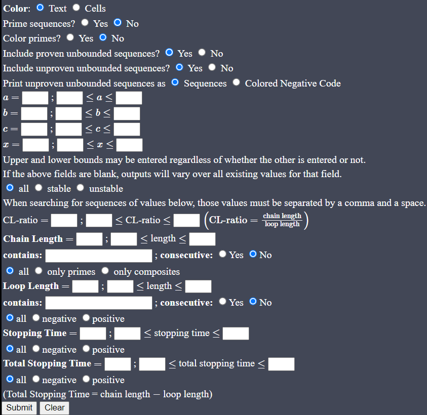
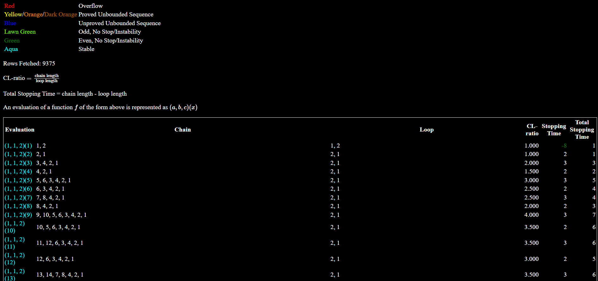
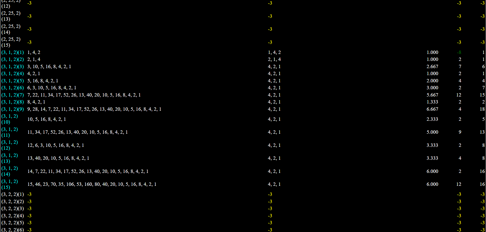

# `gen-cc`
`gen-cc` is an application for generalizing the [Collatz conjecture](https://en.wikipedia.org/wiki/Collatz_conjecture) (see also [here](https://www.youtube.com/watch?v=5mFpVDpKX70) and [here](https://www.youtube.com/watch?v=LqKpkdRRLZw)) for polynomials of degree 1 with coefficients in $\mathbb{N}$ (referring to the part of the function where the input is odd). Users will easily see that `gen-cc` achieves this goal upon entering the functions $(3, 3^k, 2)$ for $k \in \mathbb{W}$, the iterations of which consistently arrive at loops containing $\lbrace 4 \cdot 3^k, 2 \cdot 3^k, 1 \cdot 3^k\rbrace$. 

It is certainly not a proof of any sort. It is simply a general picture the behavior of the iterations of other "degree-1" functions. 

`gen-cc` contains a dynamic search feature that allows the user to search for specific sequences. 

# XAMPP
XAMPP is required to run `gen-cc`. Click [here](https://www.apachefriends.org/download.html) to download and install the appropriate version for your machine. 